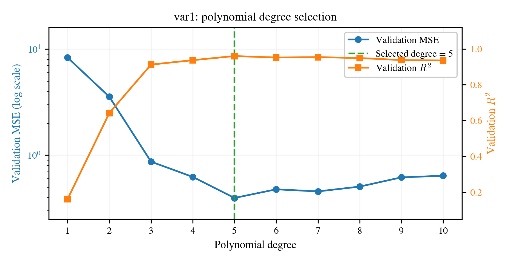
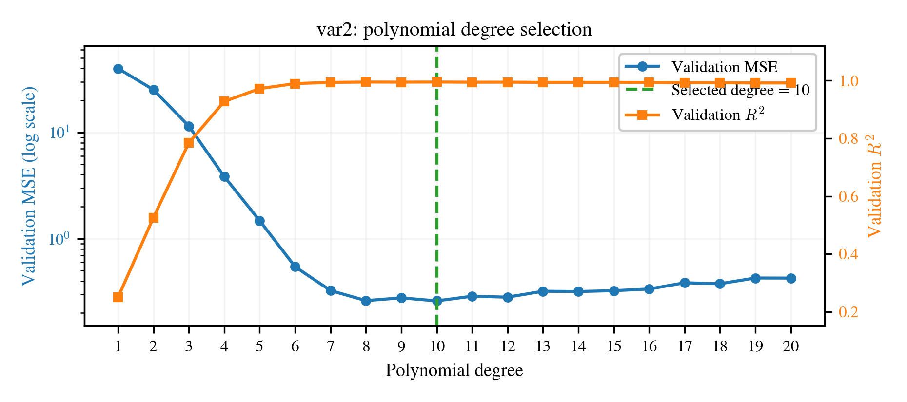

# Assignment 1: Polynomial Regression
**Vraj Vashi**  
**Roll No:** BT2024062  
**Date:** October 2026  
**GitHub Repository:** `https://github.com/VrajVashi/BT2024062-ML-Assignment`

---

## 1 Introduction

The objective of this assignment is to construct polynomial regression models for two personalized regression datasets, called *var1* and *var2*, and use the fitted models to predict the unknown target variable $y$ in their corresponding test sets. The two problems have different numbers of inputs and different permitted maximum polynomial degrees. The *var1* dataset has six input variables and permits polynomial degrees up to 10, while *var2* has three input variables and permits degrees up to 20.

The main modelling decision is the polynomial degree. A degree that is too small may not represent the relationship between the inputs and target, whereas an unnecessarily high degree creates many correlated terms and can fit noise in the training data. Therefore, all model choices in this work were made using a held-out portion of the labelled training data. The test data was used only after the model choices had been finalized. Its target values were not available and it was not used for tuning.

---

## 2 Dataset and Problem Description

The datasets were loaded and inspected using pandas. Both training sets contain 1,000 observations and have a numeric continuous target named $y$. Both test sets contain 1,000 observations with the same input columns as their corresponding training data, but without the target column. The dataset structure is summarized in Table 1.

**Table 1: Dataset structure and missing-value summary.**

| Dataset | Rows | Inputs | Target | Missing values |
|---|---|---|---|---|
| var1 training | 1000 | 6 | y | 0 |
| var1 test | 1000 | 6 | Hidden | 0 |
| var2 training | 1000 | 3 | y | 0 |
| var2 test | 1000 | 3 | Hidden | 0 |

The inputs in both training datasets range from $-1$ to $1$. In the *var1* training data, the target has mean 0.7943, standard deviation 3.2082, minimum $-10.1054$, and maximum 10.6104. In the *var2* training data, the target has mean 2.2044, standard deviation 6.6875, minimum $-29.9989$, and maximum 39.1383. Therefore, *var2* has a wider target range and larger target variance.

There were no missing or non-finite values in any file. No duplicate complete rows were found in either training set. A small number of repeated input rows appeared in the test sets, but they were retained because they are valid test cases and each row requires a prediction.

---

## 3 Methodology

### 3.1 Polynomial Regression
Polynomial regression models nonlinear relationships by expanding the original variables into powers and interaction terms, followed by a linear regression model. For example, a degree-2 expansion of two variables includes $x_1, x_2, x_1^2, x_1 x_2$, and $x_2^2$. A general polynomial model of degree $d$ can be written as:

$$\hat{y} = \beta_0 + \sum_{1 \leq |\alpha| \leq d} \beta_\alpha x^\alpha \tag{1}$$

where $\alpha$ is a multi-index and $x^\alpha$ represents powers and interactions whose total degree is no greater than $d$. The model is nonlinear in the original inputs but remains linear in its coefficients.

For $p$ original input variables and degree $d$, the number of generated polynomial terms, excluding the constant term, is:

$$\binom{p+d}{d} - 1 \tag{2}$$

The number of terms grows rapidly with the degree. For example, *var1* produces 461 terms at degree 5 and 8,007 terms at degree 10. *var2* produces 285 terms at degree 10 and 1,770 terms at degree 20. This increase in dimensionality can cause overfitting and numerical instability.

### 3.2 Preprocessing and Ridge Regression
Polynomial features were generated using `PolynomialFeatures` from scikit-learn with `include_bias=False`. The expanded features were standardized using `StandardScaler`. During validation, the scaler was fitted only on the modelling training portion, preventing information from the validation data from entering the preprocessing stage. Scaling is useful because different powers and interaction terms can have considerably different variances.

Ridge regression was used after the polynomial expansion. Ridge minimizes the following objective:

$$\sum_{i=1}^n (y_i - \hat{y}_i)^2 + \lambda \sum_{j=1}^m \beta_j^2 \tag{3}$$

where $\lambda$, called `alpha` in scikit-learn, controls the amount of coefficient shrinkage. Polynomial terms can be highly correlated, especially at high degrees. Ridge regularization improves numerical stability and reduces overfitting while keeping the modelling approach straightforward.

### 3.3 Validation and Model Selection
Each labelled dataset was divided into 80% modelling training data (800 rows) and 20% validation data (200 rows). A fixed `random_state=42` was used so that every candidate was evaluated on the same observations and the experiment could be reproduced.

Every permitted integer degree was evaluated: degrees 1–10 for *var1* and degrees 1–20 for *var2*. For each degree, the Ridge values:

$$\{0.001,\, 0.01,\, 0.1,\, 1,\, 10,\, 100,\, 1000\}$$

were tested. The alpha with the lowest validation mean squared error (MSE) was retained for that degree. The final degree-alpha combination was selected using the lowest overall validation MSE. Validation $R^2$ was also recorded as a secondary performance measure:

$$\mathrm{MSE} = \frac{1}{n} \sum_{i=1}^n (y_i - \hat{y}_i)^2 \tag{4}$$

$$R^2 = 1 - \frac{\sum_i (y_i - \hat{y}_i)^2}{\sum_i (y_i - \bar{y})^2} \tag{5}$$

After model selection, each chosen pipeline was fitted again using all 1,000 labelled training observations. The refitted model was then used to generate the corresponding test predictions.

---

## 4 Validation Results

### 4.1 Results for var1

Table 2 shows the best alpha and validation scores obtained for every tested *var1* degree.

**Table 2: Validation results for var1.**

| Degree | Terms | Best alpha | Validation MSE | Validation R² |
|---|---|---|---|---|
| 1 | 6 | 0.001 | 8.318903 | 0.161400 |
| 2 | 27 | 0.001 | 3.552212 | 0.641914 |
| 3 | 83 | 10 | 0.869064 | 0.912393 |
| 4 | 209 | 10 | 0.624337 | 0.937063 |
| **5** | **461** | **10** | **0.395527** | **0.960128** |
| 6 | 923 | 100 | 0.477003 | 0.951915 |
| 7 | 1715 | 100 | 0.455818 | 0.954051 |
| 8 | 3002 | 100 | 0.505881 | 0.949004 |
| 9 | 5004 | 100 | 0.618216 | 0.937680 |
| 10 | 8007 | 100 | 0.640541 | 0.935429 |

Degree 5 with Ridge alpha 10 was selected for *var1*. It produced the lowest validation MSE of 0.395527 and the highest validation $R^2$ of 0.960128. The large improvement from degree 1 to degree 5 shows that linear and low-degree models underfit the data. From degree 6 onward, the validation error increases even though the number of polynomial terms grows. This is evidence of increasing variance and overfitting. The complete degree comparison is shown in Figure 1.

### 4.2 Results for var2

Table 3 presents the best validation result for each tested *var2* degree.

**Table 3: Validation results for var2.**

| Degree | Terms | Best alpha | Validation MSE | Validation R² |
|---|---|---|---|---|
| 1 | 3 | 10 | 39.881477 | 0.249691 |
| 2 | 9 | 0.001 | 25.195123 | 0.525992 |
| 3 | 19 | 0.001 | 11.461392 | 0.784371 |
| 4 | 34 | 0.001 | 3.836090 | 0.927830 |
| 5 | 55 | 0.01 | 1.476417 | 0.972223 |
| 6 | 83 | 0.001 | 0.544465 | 0.989757 |
| 7 | 119 | 0.1 | 0.325143 | 0.993883 |
| 8 | 164 | 0.1 | 0.261128 | 0.995087 |
| 9 | 219 | 1 | 0.277104 | 0.994787 |
| **10** | **285** | **1** | **0.259689** | **0.995114** |
| 11 | 363 | 1 | 0.287239 | 0.994596 |
| 12 | 454 | 1 | 0.281402 | 0.994706 |
| 13 | 559 | 0.1 | 0.320029 | 0.993979 |
| 14 | 679 | 10 | 0.318016 | 0.994017 |
| 15 | 815 | 0.1 | 0.324019 | 0.993904 |
| 16 | 968 | 0.1 | 0.335610 | 0.993686 |
| 17 | 1139 | 10 | 0.384211 | 0.992772 |
| 18 | 1329 | 10 | 0.376426 | 0.992918 |
| 19 | 1539 | 10 | 0.426255 | 0.991981 |
| 20 | 1770 | 10 | 0.425356 | 0.991998 |

Degree 10 with Ridge alpha 1 was selected for *var2*. Its validation MSE is 0.259689 and its validation $R^2$ is 0.995114. The error decreases sharply from degree 1 through degree 8, indicating substantial nonlinearity and clear underfitting at low degrees. Degrees 8–12 have closer results (with degree 8 achieving 0.261128), but degree 10 gives the smallest measured MSE. Degrees above 12 do not improve validation performance and instead show a gradual increase in error. Therefore, degree 10 is preferred to the more complex degrees 11–20. This behaviour is illustrated in Figure 2.

---

## 5 Final Models and Verification

The final *var1* pipeline consists of a degree-5 polynomial expansion, feature standardization, and Ridge regression with alpha 10. The final *var2* pipeline uses a degree-10 polynomial expansion, feature standardization, and Ridge regression with alpha 1. Both selected pipelines were refitted using their complete training datasets.

The generated prediction files are `BT2024062_pred_var1.csv` and `BT2024062_pred_var2.csv`. Each contains exactly 1,000 predictions in a single column named $y$, matching the sample submission format.

The complete program was run from start to finish. It verified that the feature columns and their order match between training and test data, that the test sets do not contain the target, and that all input values and predictions are finite. It also checked the degree restrictions, prediction row counts, and saved CSV column names. The saved files were read back after writing to verify the actual deliverables. All checks passed, and repeated executions produced identical prediction files. No hidden test target or test-derived score was used during model selection.

---

## 6 Conclusion

Polynomial regression successfully represented the nonlinear relationships in both datasets. Training-only validation selected degree 5 with Ridge alpha 10 for *var1* and degree 10 with Ridge alpha 1 for *var2*. Their validation results were MSE 0.395527 with $R^2 = 0.960128$, and MSE 0.259689 with $R^2 = 0.995114$, respectively.

The experiments demonstrate the bias–variance trade-off. Low-degree models underfit both datasets, while unnecessarily high degrees generate many polynomial terms and reduce validation performance. Standardization and Ridge regularization made the polynomial models more stable, while validation-based model selection ensured that the hidden test set did not influence the modelling decisions.

---

## References

[1] Scikit-learn Developers, “PolynomialFeatures,” `https://scikit-learn.org/stable/modules/generated/sklearn.preprocessing.PolynomialFeatures.html`.  
[2] Scikit-learn Developers, “Ridge Regression,” `https://scikit-learn.org/stable/modules/generated/sklearn.linear_model.Ridge.html`.  
[3] G. James, D. Witten, T. Hastie, and R. Tibshirani, *An Introduction to Statistical Learning*, Springer, 2021.
